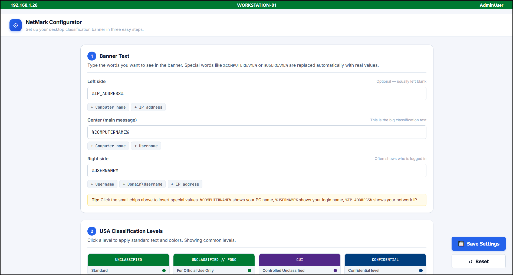

# NetMark

NetMark is a lightweight, standalone desktop classification banner for Windows. It provides a persistent, customizable bar at the top of your screen (and optional borders along the edges) to display security classification levels—such as "UNCLASSIFIED", "CUI", or "SECRET"—or important system information like IP addresses and computer names.

## Why It Exists

In government, military, and corporate environments, workstations are often required to display a visual classification level at all times to prevent the mishandling of sensitive information. Traditional tools built for this purpose are frequently clunky, require heavy administrative installations, demand unnecessary background privileges, or interfere with daily work by covering up application windows. 

NetMark was built to solve these problems. It is completely portable—requiring no installation—does not clutter the taskbar, does not demand administrator rights, and plays nicely with modern displays, multiple monitors, and Remote Desktop connections. It provides a clean, professional, and highly customizable way to meet security marking requirements without getting in the user's way.

## Key Features

- **Zero Installation Required:** NetMark runs as a single, self-contained `.exe` file. It includes its own underlying runtime, meaning you don't need to install .NET or any other frameworks on the target computer. You can run it from a hard drive, a USB stick, or a network share.
- **Stays Out of the Way (Native AppBar):** Instead of just drawing a box on top of your screen, NetMark politely tells Windows to reserve a tiny slice of space at the very top. When you maximize your web browser or word processor, it will stop perfectly below the banner, ensuring the classification text is never hidden and your window controls remain accessible.
- **Smart Remote Desktop Handling:** If you use Remote Desktop to connect to another computer, NetMark knows to temporarily hide itself when you enter full-screen mode. This prevents it from covering up the Remote Desktop connection bar at the top of the screen. It instantly reappears when you minimize or close the connection.
- **Live Configuration Updates:** NetMark actively watches its configuration file. If you change a setting in the INI file, the banner updates its text and colors instantly without needing to restart the program.
- **Multi-Monitor Friendly:** Plug in a second or third monitor, and NetMark automatically duplicates itself onto the new screens, adjusting for different sizes, resolutions, and DPI scales instantly without manual intervention.
- **Built-in HTML Configurator:** A modern, easy-to-use configuration web page is built right into the app. Open it, click a preset classification level (like "CUI" or "SECRET"), customize your colors and fonts, and the banner updates instantly.
- **Dynamic System Information:** Need to display the user's current IP address, username, or computer name right in the banner? NetMark can securely evaluate custom PowerShell scripts in the background and display the results, updating automatically if the network changes.

## Who Should Use It

- **Government and Military Personnel:** Who need to comply with strict desktop classification marking requirements (DoD, Intelligence Community, Federal Agencies).
- **Defense Contractors:** Working on CUI (Controlled Unclassified Information) or classified programs who need a reliable, easily deployable marking tool that doesn't require complex installer packages.
- **System Administrators:** Managing secure environments who want a zero-dependency, portable executable that can be pushed to workstations easily using scripts, network shares, or deployment tools.
- **Everyday Power Users:** Who simply want a persistent, un-intrusive status bar at the top of their screen displaying custom system information.

## Compiling Your Own Build

For security and transparency, NetMark is distributed as a PowerShell generator script. This allows you to inspect exactly what goes into the application and compile it yourself locally. 

### Prerequisites
To build the executable, you only need:
- A Windows machine
- The **.NET 8 SDK** (or newer) installed
- PowerShell

### Steps to Compile
1. Save the provided `NetMark.ps1` script to a folder on your computer (for example, `C:\temp\`).
2. Open Windows PowerShell as a admin.
3. Navigate to the folder where you saved the script:
   `cd C:\temp`
4. Run the script:
   `.\NetMark.ps1`
5. After it runs, it will create C:\dev\NetMark directory where the files have been compiled.
6. Navigate using explorer to this path to see your newly created files.
   `C:\Dev\NetMark\bin\Release\publish`

The script will automatically clean the directory, emit all the necessary C# source files, the embedded HTML configuration page, and the default INI file. It then invokes the .NET compiler to build a single, portable, self-contained `.exe` file. 

Once compilation is finished, the script will automatically launch your newly built NetMark banner and open the HTML configurator in your default web browser so you can begin customizing it.
